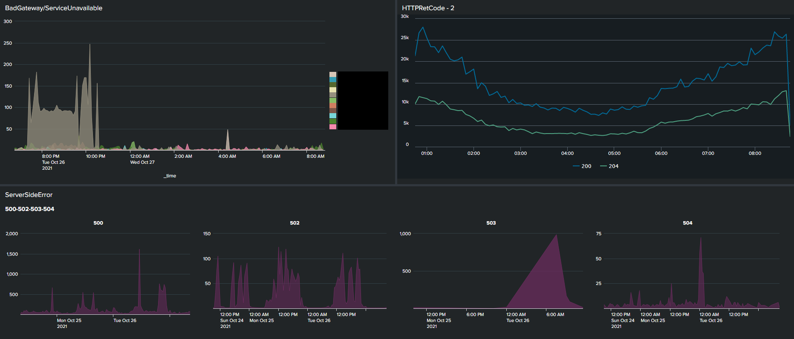
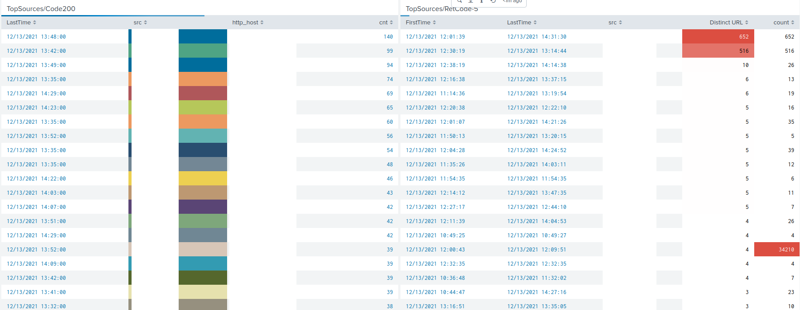

# fortiweb-fortigate-query-in-splunk
This repository contains splunk queries and vizualization for both fortiweb and fortigate devices which help SOC analyst and security specialist to detect anomaly behaviour in some cases.

Queries and screenshots of each asset is placed in their directory.

